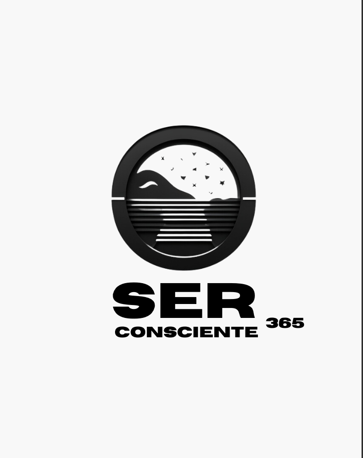
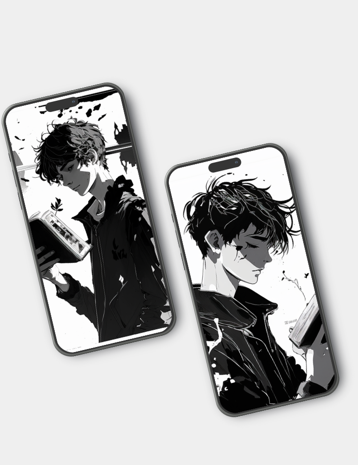
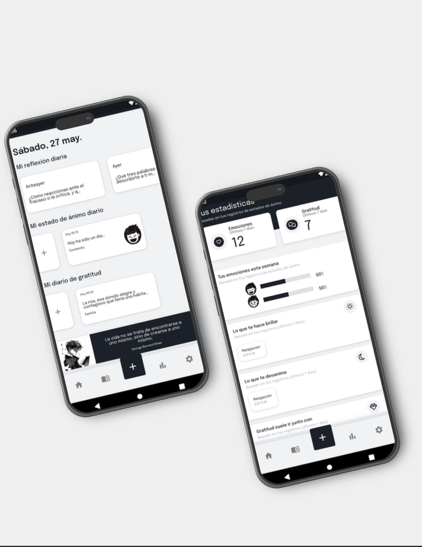
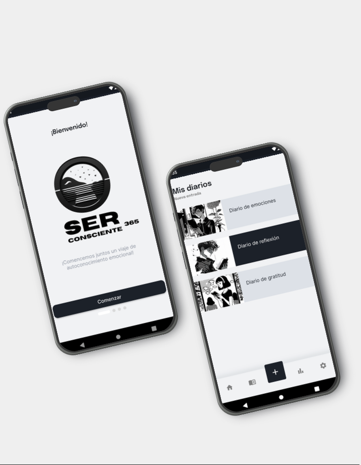

# SerConsciente365 📱

## Aplicación móvil para el registro diario de emociones

---

## 📋 Descripción del Proyecto

**SerConsciente365** es una aplicación móvil diseñada para ayudar a las personas a desarrollar su inteligencia emocional y mejorar su bienestar emocional diario. La aplicación combina dos técnicas efectivas basadas en evidencia científica: el **diario de emociones** y la **escritura reflexiva**.

### Contexto y Justificación

La aplicación surge ante la compleja situación del bienestar emocional en la sociedad actual, donde múltiples factores como el estrés laboral, la falta de tiempo para el ocio y recreación, la sobreexposición a las redes sociales y la falta de conexión interpersonal pueden llevar a una disminución en la calidad de las relaciones interpersonales y a un aumento en la sensación de soledad e incomprendido.

La aplicación proporciona una plataforma segura y privada que permite a los usuarios:

- Registrar y categorizar sus emociones diarias
- Realizar escritura reflexiva para fomentar la introspección
- Visualizar patrones emocionales a lo largo del tiempo
- Desarrollar mayor autoconciencia y bienestar emocional

---

## 🎨 Diseño

### Diseño Centrado en el Usuario

El proyecto siguió una metodología de diseño centrado en el usuario, realizando:

- **Encuestas** para identificar necesidades y preferencias
- **Entrevistas** con usuarios potenciales
- **Creación de personas** (user personas) para guiar el diseño
- **Prototipado** iterativo de la interfaz
- **Evaluación** de usabilidad

### Diseño HIFI

A continuación se presentan las capturas del diseño de alta fidelidad (HIFI) de la aplicación:

  
  
  
  

### Paleta de Colores y Tipografía

- **Tipografía:** Epilogue e Inter (Google Fonts)
- **Diseño:** Minimalista y enfocado en la experiencia del usuario

### Capturas de Pantalla

A continuación se muestran capturas de pantalla de la aplicación en funcionamiento:

  
  
  
  

---

## ✨ Características Principales

### Funcionalidades Implementadas

* **📝 Registro y categorización de emociones:** Los usuarios pueden registrar fácilmente sus emociones diarias y categorizarlas, ayudando a identificar y comprender patrones emocionales.
* **✍️ Escritura reflexiva:** Se proporcionan herramientas de escritura reflexiva para fomentar la introspección y el autoconocimiento.
* **📅 Calendario visual:** Los usuarios pueden visualizar sus emociones a lo largo del tiempo, lo que facilita la detección de patrones y tendencias emocionales.
* **🔔 Recordatorios:** Sistema de recordatorios para motivar a los usuarios a escribir en su diario emocional de manera regular.
* **📊 Análisis emocional:** La aplicación ofrece análisis y seguimiento de patrones emocionales a través de gráficos y estadísticas.
* **🎨 Personalización:** Los usuarios pueden personalizar y adaptar la aplicación a sus necesidades individuales.
* **☁️ Sincronización en la nube:** Los datos de los usuarios se sincronizan en la nube mediante Firebase para acceder a ellos desde cualquier dispositivo.

---

## 🛠️ Tecnologías y Arquitectura

### Stack Tecnológico

- **Flutter:** Framework de UI de código abierto de Google para crear aplicaciones móviles compiladas nativamente para iOS y Android
- **Dart:** Lenguaje de programación utilizado por Flutter
- **Firebase (BaaS):** Plataforma de Backend as a Service que proporciona:
  - **Firestore:** Base de datos NoSQL en tiempo real
  - **Firebase Authentication:** Sistema de autenticación de usuarios
  - **Firebase Storage:** Almacenamiento de archivos
  - **Firebase Cloud Functions:** Funciones serverless

### Arquitectura

El proyecto sigue los principios de **Clean Architecture**, organizando el código en capas separadas:

- **Capa de Presentación:** Widgets y lógica de UI
- **Capa de Dominio:** Lógica de negocio y casos de uso
- **Capa de Datos:** Repositorios y fuentes de datos

### Patrón de Diseño

- **BLoC Pattern:** Para la gestión del estado de la aplicación de manera reactiva y escalable

### 🎯 Puntos Destacados del Desarrollo

- ✅ **Arquitectura escalable:** Implementación de Clean Architecture para facilitar el mantenimiento y la escalabilidad
- ✅ **Gestión de estado reactiva:** Uso del patrón BLoC para un flujo de datos predecible y testeable
- ✅ **Backend serverless:** Integración completa con Firebase para reducir la complejidad del backend
- ✅ **Diseño responsivo:** Interfaz adaptativa que funciona en diferentes tamaños de pantalla
- ✅ **Sincronización en tiempo real:** Datos sincronizados automáticamente entre dispositivos

---

## 📦 Descarga

La aplicación está disponible en **Google Play Store**:

🔗 [Descargar desde Google Play](https://play.google.com/store/apps/details?id=com.odremanferrer.serconsciente365&hl=es_MX&gl=US)

## 🎯 Objetivos del Proyecto

### Objetivos Generales

1. Desarrollar una aplicación móvil que combine técnicas de diario de emociones y escritura reflexiva
2. Proporcionar una herramienta digital para mejorar el bienestar emocional de los usuarios
3. Facilitar el desarrollo de la inteligencia emocional a través del uso continuado de la aplicación

### Objetivos Técnicos

1. Implementar una arquitectura escalable y mantenible
2. Garantizar la seguridad y privacidad de los datos del usuario
3. Proporcionar una experiencia de usuario intuitiva y agradable
4. Asegurar el rendimiento y la eficiencia de la aplicación

---

## 📖 Base Científica

La aplicación se fundamenta en investigaciones científicas que demuestran los beneficios de:

- **Inteligencia Emocional (Goleman, 1996):** Desarrollo de habilidades para reconocer, entender y gestionar emociones
- **Escritura Expresiva (Baikie & Wilhelm, 2005):** Beneficios físicos y emocionales de la escritura reflexiva
- **Terapia de Aceptación y Compromiso (Hayes et al., 2012):** Enfoque basado en mindfulness y valores personales

---

## 🧪 Pruebas y Calidad

El proyecto incluyó:

- Pruebas unitarias de componentes críticos
- Pruebas de integración
- Pruebas de usabilidad con usuarios reales
- Refactorización continua para mejorar la mantenibilidad del código

---

## 📊 Resultados

La aplicación fue desarrollada exitosamente cumpliendo con los objetivos establecidos:

- ✅ Implementación completa de funcionalidades principales
- ✅ Diseño centrado en el usuario
- ✅ Arquitectura escalable y mantenible
- ✅ Publicación en Google Play Store
- ✅ Interfaz intuitiva y atractiva

---

## 🔮 Líneas de Trabajo Futuro

Posibles mejoras y funcionalidades futuras:

- Análisis avanzado con inteligencia artificial
- Integración con wearables para seguimiento automático
- Comunidad de usuarios para compartir experiencias
- Integración con calendarios y recordatorios del sistema
- Modo offline mejorado
- Exportación de datos en diferentes formatos

---

## 👤 Autor

**Odreman Abraham Ferrer Díaz**

Desarrollador de aplicaciones móviles especializado en Flutter

[📧 Email](mailto:odreman.ferrer@gmail.com) • [🔗 Google Play](https://play.google.com/store/apps/details?id=com.odremanferrer.serconsciente365&hl=es_MX&gl=US)

---

## 📄 Licencia

Esta obra está sujeta a una licencia de **Reconocimiento-NoComercial-SinObraDerivada 3.0 España de Creative Commons**.

Todos los derechos reservados © Odreman Ferrer. No se permite el uso, la copia, la distribución ni la modificación del código sin el permiso explícito del autor.

---

  
Desarrollado con ❤️ usando Flutter y Firebase

  
Si este proyecto te resulta útil, ¡considera darle una ⭐!

